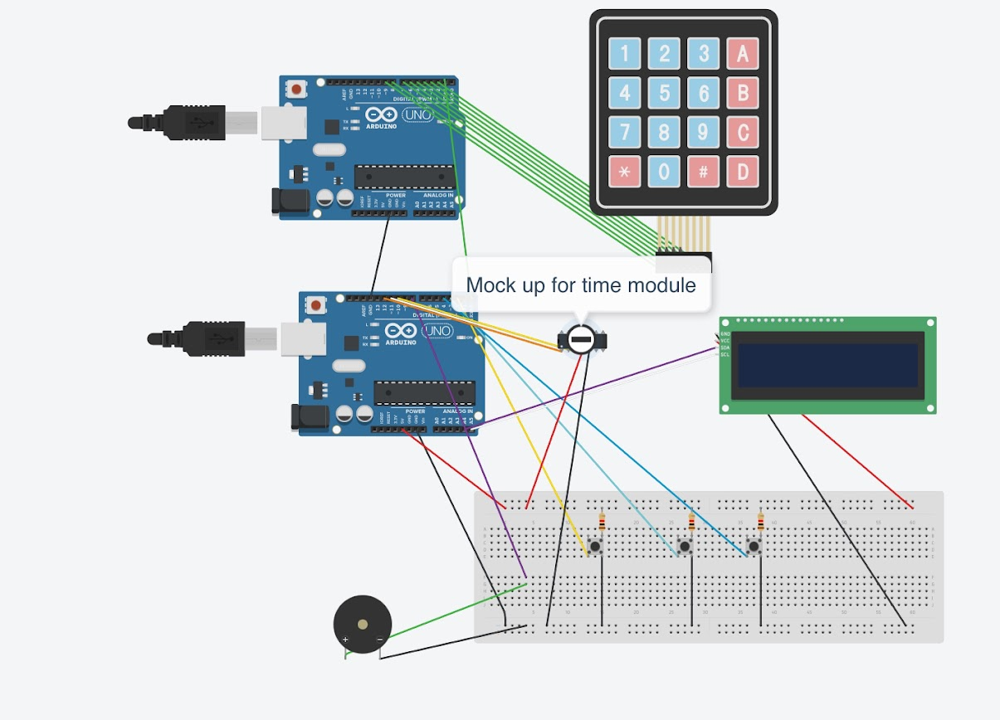

# Arduino Alarm Clock

A mini arduino project that we can set alarm clock and play melody for the alarm.

## Circuit

## Features

- Current Time and Date
- Alarm Clock
- Alarm Melody

## Contributors

- [Archawit Changtor](https://github.com/kittipattan)
- [Pakapon Rattanasrisuk](https://github.com/PakaponRattanasrisuk)

## Related Course

CSS332 Microcontrollers and Applications, SIIT
